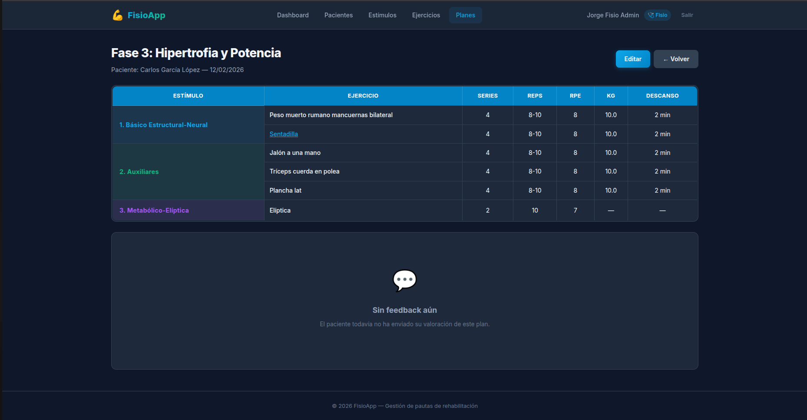
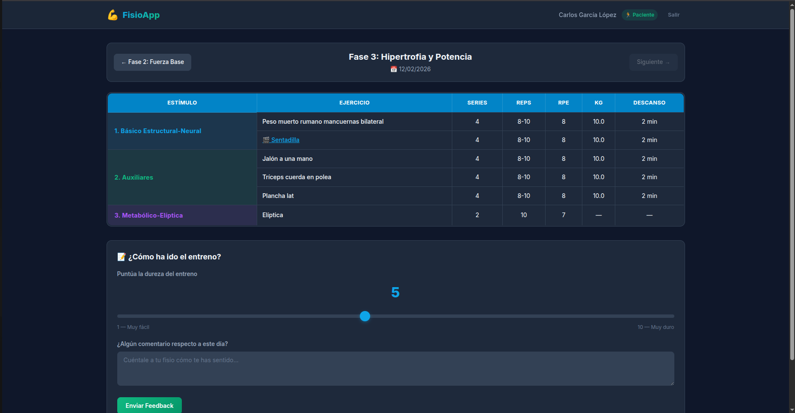

# FisioApp - Gestión de Rehabilitación y Entrenamiento 🏋️‍♂️

Aplicación web profesional para fisioterapeutas que permite la gestión integral de pacientes, diseño de planes de entrenamiento personalizados y seguimiento del progreso mediante feedback.




## 🚀 Características Principales

### 🩺 Para el Fisioterapeuta (Admin)
- **Gestión de Pacientes**: Alta, baja y modificación de fichas de pacientes.
- **Constructor de Planes Dinámico**: Creación de rutinas de ejercicio personalizadas.
- **Biblioteca de Ejercicios**:
  - Clasificación por Estímulos (Básico, Auxiliar, Metabólico).
  - Integración automática de vídeos de YouTube.
- **Seguimiento**: Visualización del feedback subjetivo (RPE) y comentarios de los pacientes.

### 🏃 Para el Paciente
- **Portal Personalizado**: Acceso seguro sin contraseña compleja (Nombre + Apellidos).
- **Visualización de Rutinas**:
  - Tabla interactiva estilo Excel.
  - Vídeos demostrativos integrados en modal.
  - Ordenación lógica de ejercicios (Básico -> Auxiliar -> Metabólico).
- **Historial**: Navegación entre planes anteriores y actuales.
- **Feedback**: Envío de valoración de dureza y comentarios post-entreno.

## 🛠️ Requisitos Técnicos

- **Docker Desktop** (para el entorno de desarrollo)
- **PHP 8.2+** y **Composer** (opcional si usas Docker)
- **Node.js** y **NPM**

## 📦 Instalación y Despliegue Local

El proyecto utiliza **Laravel Sail**, un entorno de desarrollo basado en Docker.

1. **Clonar el repositorio**:
   ```bash
   git clone https://github.com/tu-usuario/web-hibrida.git
   cd web-hibrida
   ```

2. **Copiar configuración de entorno**:
   ```bash
   cp .env.example .env
   ```

3. **Iniciar contenedores (Docker)**:
   ```bash
   ./vendor/bin/sail up -d
   ```

4. **Instalar dependencias y generar clave**:
   ```bash
   ./vendor/bin/sail composer install
   ./vendor/bin/sail artisan key:generate
   ./vendor/bin/sail npm install && ./vendor/bin/sail npm run build
   ```

5. **Migrar base de datos y datos de prueba**:
   ```bash
   ./vendor/bin/sail artisan migrate:fresh --seed
   # Opcional: Generar historial de prueba
   ./vendor/bin/sail artisan db:seed --class=PlanHistorialSeeder
   ```

6. **¡Listo!** Accede a la aplicación en:
   - 🔗 [http://localhost](http://localhost)

## 🔑 Credenciales de Acceso (Demo)

### Admin (Fisioterapeuta)
- **Email**: `fisio@fisioapp.com`
- **Contraseña**: `password`

### Paciente (Demo)
- **Nombre**: `Carlos`
- **Primer Apellido**: `García`
- **Segundo Apellido**: `López`

## 🎨 Estructura del Proyecto

- `app/Models`: Modelos Eloquent (`User`, `Plan`, `Ejercicio`, `Estimulo`, `Feedback`).
- `app/Http/Controllers/Admin`: Controladores para la gestión del fisio.
- `app/Http/Controllers/Paciente`: Controladores para la vista del paciente.
- `resources/views`: Plantillas Blade con diseño responsive y "glassmorphism".
- `database/seeders`: Datos iniciales para pruebas rápidas.

## ☁️ Despliegue en Producción (AWS/VPS)

Para desplegar en un servidor de producción:
1. Configurar un servidor con Docker y Docker Compose.
2. Clonar el repositorio y configurar `.env` con las credenciales de producción.
3. Ejecutar los comandos de Docker Compose para levantar los servicios.
4. Configurar un proxy inverso (Nginx) para apuntar al puerto del contenedor.

---
